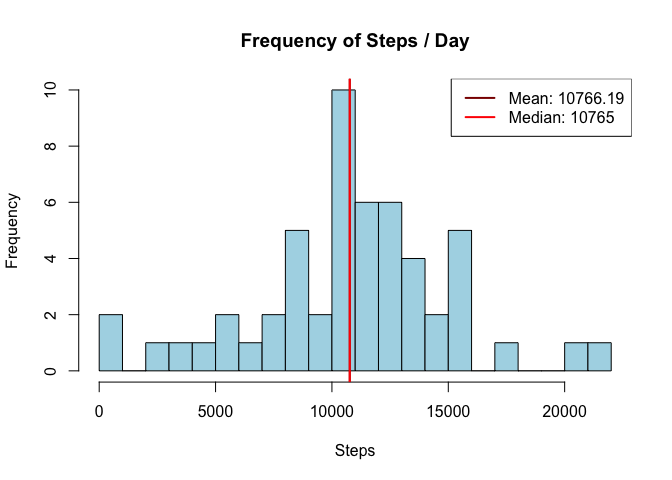
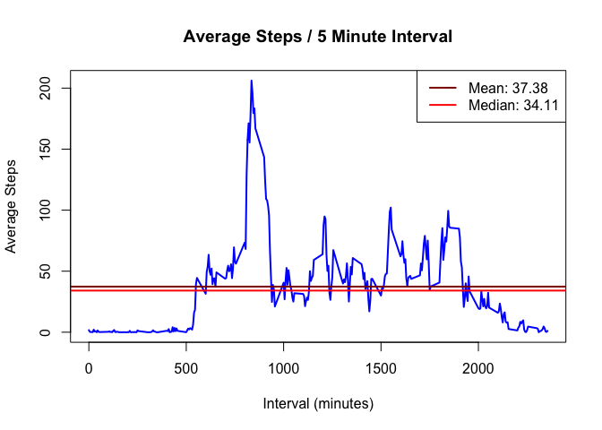
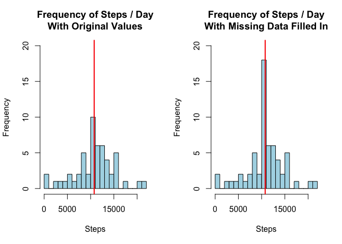
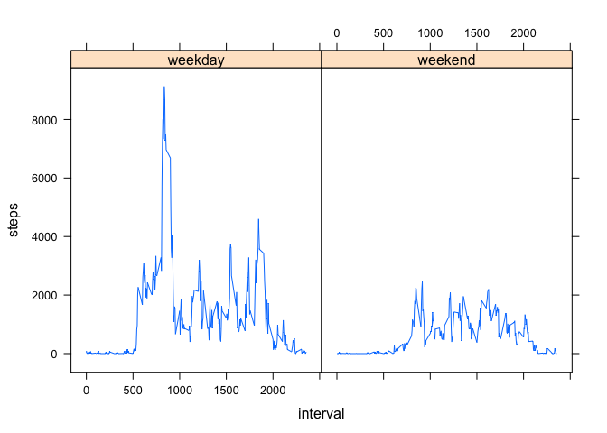

# Reproducible Research: Peer Assessment 1


## Loading and preprocessing the data

First we will load the data. The data is included in the file `activity.zip` which we will expand into `activity.csv` if it hasn't been already.


```r
if ( !file.exists("activity.csv") ) {
    unzip("activity.zip")
}
```

Then we will load it into a `data.frame`.


```r
imported.step.data <- read.csv("activity.csv",
                               colClasses=c("numeric","Date","numeric")
                               )
```

The data is already in a format that is appropriate for use so we won't be doing any data cleaning.


## What is mean total number of steps taken per day?

First, we will do some exploration of the total number of steps taken per day by calculating the sum per day.


```r
daily.steps <- with( imported.step.data,
                     aggregate(steps ~ date, FUN=sum))

hist(daily.steps$steps,
     xlab="Steps", col="lightblue", main="Frequency of Steps / Day",
     breaks=20 )

daily.steps.mean <- round(mean(daily.steps$steps),2)
daily.steps.median <- round(median(daily.steps$steps),2)

abline(v=daily.steps.mean, col="red4", lwd=2)
abline(v=daily.steps.median, col="red", lwd=2)

legend("topright",
       legend=c(paste("Mean:",daily.steps.mean),paste("Median:",daily.steps.median)),
       col=c("red4","red"),
       lwd=2)
```

 

#### Mean

```r
message(paste("Mean: ", daily.steps.mean))
```

```
## Mean:  10766.19
```

#### Median

```r
message(paste("Median: ", daily.steps.median))
```

```
## Median:  10765
```

## What is the average daily activity pattern?

#### Activity Pattern Aggregated by 5 Minute Interval

Next, we will calculate which five minute interval during the day is the most active due as indicated by number of steps.


```r
interval.steps <- with( imported.step.data,
                        aggregate(steps ~ interval, FUN=mean))

plot(interval.steps,
     type="l", lwd=2,
     xlab="Interval (minutes)", ylab="Average Steps",
     col="blue", main="Average Steps / 5 Minute Interval")

interval.steps.mean <- round(mean(interval.steps$steps),2)
interval.steps.median <- round(median(interval.steps$steps),2)

abline(h=interval.steps.mean, col="red4", lwd=2)
abline(h=interval.steps.median, col="red", lwd=2)

legend("topright",
       legend=c(paste("Mean:",interval.steps.mean),paste("Median:",interval.steps.median)),
       col=c("red4","red"),
       lwd=2)
```

 

#### Maximum Number of Steps

The top five intervals sorted by steps.


```r
sorted.interval.steps <- interval.steps[order(-interval.steps$steps),]
head(sorted.interval.steps, n=5)
```

```
##     interval    steps
## 104      835 206.1698
## 105      840 195.9245
## 107      850 183.3962
## 106      845 179.5660
## 103      830 177.3019
```

The most active interval as deturmined using steps.


```r
most.active.interval <- sorted.interval.steps$interval[1]
message("Most active interval: ", most.active.interval)
```

```
## Most active interval: 835
```

Assuming that the interval `0` starts at midnight, that interval roughly equates to:

```r
message(paste("Time of day:",format(as.POSIXlt(most.active.interval*60, origin="2015-01-01"),"%H:%M")))
```

```
## Time of day: 08:55
```

## Imputing missing values
#### Occurances Of Missing Data

The following is the number of NA values for steps data.


```r
sum(is.na(imported.step.data$steps))
```

```
## [1] 2304
```

#### Missing Data Strategy

This report will be using the mean steps per five minute interval to fill in missing data. The hypothesis is that the number of steps is naturally lower at night and therefor using the mean or median for the entire day would improperly inflate number of steps while people are sleeping.

#### Filling in the Missing Data

Next, we will fill in the `NA` data with the values from `interval.steps` which contains the mean by interval.

#### Conclusion

```r
par(mfcol = c(1,2))

ylim = c(0,20)

hist(daily.steps$steps,
     xlab="Steps", col="lightblue", main="Frequency of Steps / Day\nWith Original Values",
     breaks=20, ylim=ylim )

abline(v=daily.steps.mean, col="red4", lwd=2)
abline(v=daily.steps.median, col="red", lwd=2)

expected.steps = sapply(imported.step.data$interval, function(x){ interval.steps$steps[interval.steps$interval == x] })

steps.adjusted <- imported.step.data
steps.adjusted$steps[is.na(imported.step.data$steps)] <- expected.steps[is.na(imported.step.data$steps)]

daily.steps.adjusted <- with( steps.adjusted,
                              aggregate(steps ~ date, FUN=sum))

hist(daily.steps.adjusted$steps,
     xlab="Steps", col="lightblue", main="Frequency of Steps / Day\nWith Missing Data Filled In",
     breaks=20, ylim=ylim )

daily.steps.adjusted.mean <- round(mean(daily.steps.adjusted$steps),2)
daily.steps.adjusted.median <- round(median(daily.steps.adjusted$steps),2)

abline(v=daily.steps.adjusted.mean, col="red4", lwd=2)
abline(v=daily.steps.adjusted.median, col="red", lwd=2)
```

 

Filling in the missing data increased the frequency of the values that were already high frequency but predictably did not change the overall shape of the histogram. Likewise, the mean and median remain the same. Part of the reason this did not have a significant effect is some of the data is not `NA` but rather `0` which would not be replaced via this script.

## Are there differences in activity patterns between weekdays and weekends?

First, we will plot the interval data split by weekend or weekday.


```r
imported.step.data$day.type <- as.factor(sapply(imported.step.data$date,function(x){
    ifelse(weekdays(x) %in% c("Saturday", "Sunday"), "weekend", "weekday")
}))

weekday.steps <- with( imported.step.data,
                       aggregate(steps ~ interval + day.type, FUN=sum))

library(lattice)
with( weekday.steps, xyplot(steps~interval | factor(day.type), type = "l"))
```

 

Yes, There is a significant difference between weekday and weekend. The number of steps is significantly lower and the steps start to increase later in the day.
